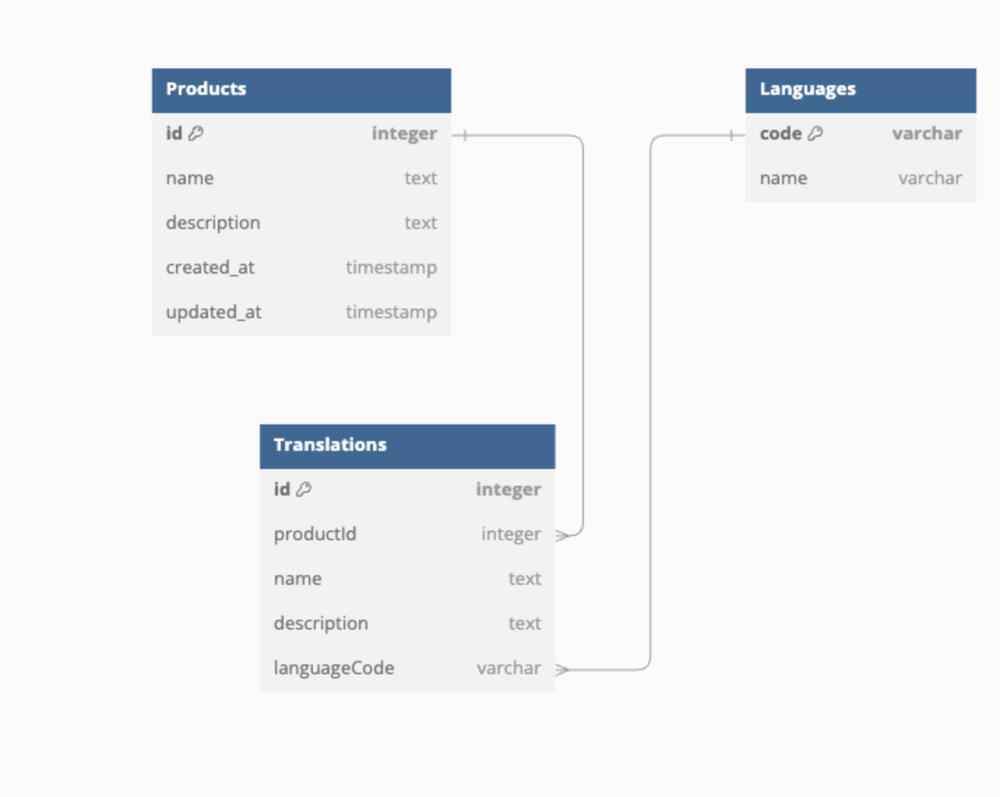

# Back-end Questions

1. ## Designing an API for near real-time data aggregation

- API Gateway: Use the API Gateway as the single entry point to routing, authentication, logging, and enhancing security  
- Caching: Use a caching layer like Redis to store frequently accessed data, reducing database load and improving response times for high-demand queries.  
- Message Broker: Integrate a message broker like Kafka to create asynchronous data pipelines. This enables decoupled services to process data independently, improving scalability and reducing latency.

2. ## Performance test strategy plan

   Q:
   Assuming the team has started planning a new project, the project manager asks you for a performance test strategy plan for this release. How would you recommend proceeding to the project manager?  
   A:

- Define performance goals (response time, throughput, resource use, or other metrics)  
- Design Test Scenarios and  Test Cases  
- Test in a production-like environment using tools like JMeter for load testing and New Relic for monitoring.
- Perform load, stress, endurance, and spike testing to evaluate behavior under various conditions.
- Analyze logs to identify bottlenecks and optimize database queries, caching, and code for better performance.   

3. ### Design and develop two APIs using NestJS and Postgres with the following specifications 

   Q:        

- Create a Multilingual Product API: Develop an API that allows for the creation of products, each with attributes for name and description that support multiple languages.  
  - Multilingual Product Search API: Implement an API that enables searching for products by name in any language and returns results in a paginated format.
                        
   A:

- Validation        

   Use class-validator decorators in DTOs (Data Transfer Objects) to enforce validation rules on inputs, such as ensuring required fields are present and follow the correct format.  
  And re-validate the data format correctness again before storing data into database        

- Database Design

  
             
 Here we have 3 tables, Products, Languages, and Translations.

1. Products table:

Contains basic information about the product, such as name, description, and timestamps (created\_at, updated\_at). The id serves as the primary key.

2. Translations table:

Links to the Products table through the productId foreign key, which establishes a one-to-many relationship (one product can have multiple translations).  
Includes name and description fields for translated values, as well as languageCode for identifying the language.

3. Languages table:

Contains metadata for languages, such as language code (e.g., "en", "th") which represent the full language name (e.g., "English", "Thai").  
The relationship between Translations and Languages is represented by the languageCode, which acts as a foreign key to ensure the translation references a valid language.

Given the limited time for implementation, I would design the system to support a specific set of languages, such as Thai and English, allowing the user to work within these predefined options.

If we have a bit more time, I would improve the search functionality using OpenSearch with multilingual embedding models. These models allow for semantic search by converting text into vectors, enabling accurate multilingual searches without needing to manually create translations for each product. From my experience with OpenSearch, it also supports hybrid search, combining traditional text-based searches with vector-based semantic searches. This approach gives us the opportunity to leverage the strengths of both methods, semantic search for context-based queries and traditional text-based search for non-semantic data like product codes (e.g., Product-AB-911).

- **Testing Strategy**:
  \- Unit tests: test both APIs with mockup data to validate the correctness of business logic in isolation. Using tools like Jest.

- Integration tests: connect our APIs with the real data in the database to validate that the service interacts correctly with the database. Here I use Nestjs Typeorm with Postgresql database.  
- End-to-end testing: Test the entire API workflow, from request to response, in an environment similar to production. Test APIs using a tool like Postman or automated frameworks. Simulate real-world scenarios: Create Product, send a request with translations and verify the database updates. Search Product, Validate language-based search and pagination functionality.  
         
# React Question

1. ## UseCallback ใช้ทำอะไร

   ใช้เวลาอยาก cache ฟังก์ชั่นไว้ เพื่อให้เวลา render component ใหม่ ไม่ต้อง run function นั้นใหม่ ได้ใช้บ่อยตอนส่งฟังก์ชั่นไปใน props

2. ## Unit Test for UserProfile Using Jest and React Testing Library
```
import { render, screen } from '@testing-library/react';  
import '@testing-library/jest-dom';  
import UserProfile from './UserProfile';

global.fetch \= jest.fn();

afterEach(() \=\> {  
    jest.clearAllMocks();  
});

describe('UserProfile Component', () \=\> {  
    it('renders loading state initially', () \=\> {  
        render(\<UserProfile userId\='999' /\>);  
        expect(screen.getByText(/loading/i)).toBeInTheDocument();  
    });

    it('renders user data on successful fetch', async () \=\> {  
        fetch.mockResolvedValueOnce({  
            ok: true,  
            json: async () \=\> ({  
                name: 'Parn Chanan',  
                email: 'parn@mail.com',  
            }),  
        });

        render(\<UserProfile userId\='999' /\>);

        expect(  
            await screen.findByText(/Parn Chanan/i)  
        ).toBeInTheDocument();  
        expect(  
            await screen.findByText(/parn@mail.com/i)  
        ).toBeInTheDocument();  
    });

    it('renders error message on fetch failure', async () \=\> {  
        fetch.mockRejectedValueOnce(  
            new Error('Failed to fetch user data')  
        );

        render(\<UserProfile userId\='999' /\>);

        expect(await screen.findByText(/Error:/i)).toBeInTheDocument();  
        expect(  
            await screen.findByText(/Failed to fetch user data/i)  
        ).toBeInTheDocument();  
    });  
});
```

